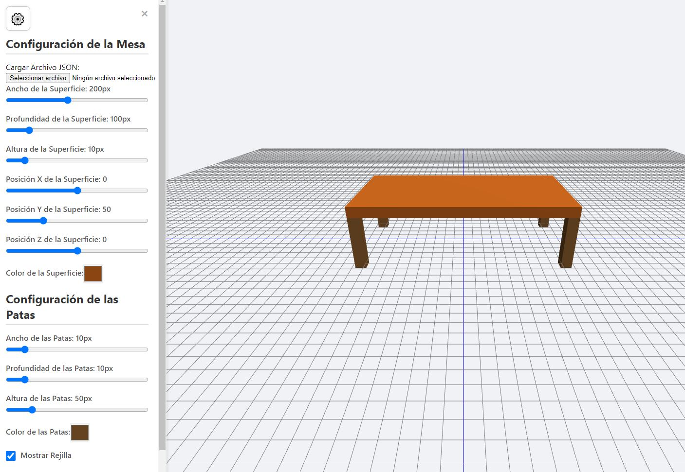

# 3D Table Drawer

3D Table Drawer es una aplicación web interactiva que permite diseñar y personalizar mesas en un entorno 3D utilizando Three.js. La interfaz incluye un panel de control lateral donde se pueden ajustar dimensiones, colores y posiciones, además de la posibilidad de descargar la configuración en formato JSON.

## Acceso Rápido a la Aplicación
[Unicornio 3D CAD - Demo en vivo](https://xococode.github.io/Unicornio3d/)

## Características
- **Interfaz en 3D:** Visualiza y ajusta mesas en tiempo real.
- **Controles personalizables:** Modifica el tamaño, color y posición de la superficie y patas.
- **Carga y descarga de configuraciones:** Guarda y carga tus mesas en formato JSON.
- **Panel lateral intuitivo:** Ajustes dinámicos a través de deslizadores y selectores de color.
- **Diseño responsivo:** Adaptado para pantallas pequeñas y grandes.

## Requisitos
- Navegador actualizado (Chrome, Firefox, Edge, Safari).
- Conexión a internet para cargar las librerías de Three.js.

## Uso
1. **Abrir el panel lateral:** Haz clic en el botón ⚙️ en la esquina superior izquierda.
2. **Modificar dimensiones y colores:** Usa los deslizadores y selectores de color para ajustar la mesa.
3. **Guardar configuración:** Haz clic en **Descargar JSON** para guardar la configuración actual.
4. **Restablecer valores:** Presiona el botón **Reiniciar** para volver a los valores predeterminados.
5. **Cargar configuraciones:** Usa el botón de carga para importar configuraciones en formato JSON.

_Disfruta personalizando tus propias mesas en 3D!_

